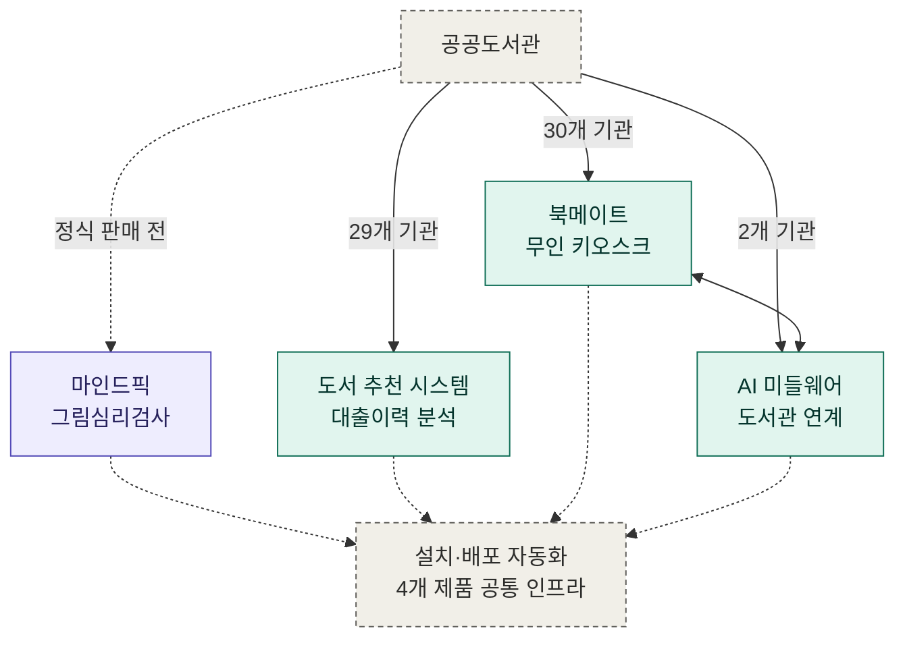

# 김영근 | Backend Engineer

📧 yaiba713@gmail.com | 🔗 [github.com/panorama713](https://github.com/panorama713)

---

## 요약

- **(주)이씨오** 백엔드 개발자 | 2024.01 ~ 재직 중 (2년 7개월)
- 공공도서관 대상 B2B SaaS **4종**의 서버를 설계·개발·운영. Java/Spring 기반 **MSA**, **Spring Batch 데이터 파이프라인**, **LLM 연동 서비스**를 담당했습니다.
- **AI 코딩 에이전트(Claude Code)를 실제 업무 브랜치(`claude/*`)에 도입**해 기능 개발·버그 수정·문서화에 활용하고, **PR 리뷰를 거쳐 반영하는 절차**를 운영하고 있습니다.
- **AI 심리검사 서비스 「마인드픽」의 백엔드·게이트웨이·인프라 전체를 단독으로 설계·구현**하고, **GS(Good Software) 품질인증 전 과정을 단독 수행하여 2026년 6월 인증을 획득**했습니다. 현재 조달청 등록을 진행 중입니다.
- OpenAI **Responses API**를 **SSE 스트리밍**으로 연동해 **체감 대기 시간을 26초에서 5초로 단축**했고, **벡터 검색 기반 RAG**와 **LLM 토큰 사용량 추적 체계**를 직접 구현했습니다.
- **북메이트는 30개 도서관·키오스크 65대에서 일평균 약 2,700건**을 처리하고, **도서 추천 시스템은 29개 기관**에 적용되어 **월 60만~180만 건**의 대출 이력을 다루는 배치 파이프라인을 운영하고 있습니다.
- 현장 설치 과정을 스크립트로 자동화해 **기관당 약 1시간 걸리던 설치를 5분으로 단축**하고, 비개발자도 설치할 수 있는 체계를 4개 제품에 적용했습니다.

---

## 기술 스택

| 구분 | 내용 |
|---|---|
| **주력** | Java 21 / 8, Spring Boot 3.x·2.7, Spring MVC, Spring Data JPA, MyBatis, MySQL |
| **MSA·비동기** | Spring Cloud Gateway, Netflix Eureka, Spring WebFlux(Reactor), SSE, Java Virtual Threads |
| **AI·데이터** | Spring AI, OpenAI API(Responses·Embeddings·Vector Store), FAISS, Spring Batch, Trino, PostgreSQL, MongoDB, Tibero |
| **인프라·운영** | Docker, Jenkins, Nginx, NCP(Rocky Linux), PM2, Redis, systemd, WinSW, Shell/Batch 스크립트 |
| **AI 협업** | Claude Code (실무 적용) |
| **사용 경험** | Python(FastAPI), OpenCV, Next.js/React, Electron, Jasypt, Log4j2 |

---

## 프로젝트

*보라 = 단독 개발, 청록 = 공동 개발*

| 프로젝트 | 기간      | 요약 |
|---|-----------|---|
| [1. 마인드픽 — AI 그림심리검사 기반 도서추천 서비스](projects/01-mindpick.md) | 2025.07 ~ | 백엔드·게이트웨이·인프라 전 영역 단독 개발. OpenAI Responses API + SSE 스트리밍 + RAG, GS 품질인증 획득 |
| [2. 도서 추천 시스템 — 대출 이력 기반 추천 데이터 파이프라인](projects/02-recommend-pipeline.md) | 2024.01 ~ | 29개 기관 적용, Spring Batch 기반 ETL로 월 60만~180만 건 처리 |
| [3. 북메이트 — 도서관 무인 대출·추천 키오스크 플랫폼](projects/03-bookmate.md) | 2024.01 ~ | 30개 도서관·키오스크 65대, 일평균 약 2,700건 처리 |
| [4. AI 미들웨어(북큐레이션) — 도서관 정보시스템 연계 서비스](projects/04-ai-middleware.md) | 2025.06 ~ | 2개 기관 적용, RFID 인증·개인화 추천 연계 |
| [5. 현장 설치·배포 자동화](projects/05-install-automation.md) | 2026 ~    | 4개 제품에 적용, 기관당 설치 시간 1시간 → 5분 |

---

## 개발 문화 및 그 외

- **AI 에이전트 협업** — 2026년부터 **Claude Code를 실제 업무에 도입**해 사용하고 있습니다. AI 작업을 별도 브랜치(`claude/*`)로 분리하고 **PR 리뷰를 거쳐 머지하는 절차**로 운영하여, 생성된 코드를 검증 없이 반영하지 않도록 했습니다. 리눅스 설치 스크립트·설치 문서 작성, 키오스크 재부팅 오류 수정 등에 적용했습니다.
- **품질 검증** — 마인드픽에서 GS인증 기능리스트를 직접 작성하고 **공인시험기관의 기능성·신뢰성 시험에 대응**하여 인증을 획득했습니다. 제3자 검증 기준에 맞춰 결함을 조치한 경험이 있습니다.
- **API 문서화** — Swagger/OpenAPI 명세를 유지하고, 주요 저장소에 엔드포인트·요청/응답 스펙·실행 방법을 담은 README를 작성해 연동 담당자와 협업했습니다.
- **커밋 컨벤션** — `feat`/`fix`/`refactor`/`build`/`docs` 접두사 기반 컨벤션과 PR 머지 방식으로 변경 이력을 관리했습니다.
- **로깅·운영** — Log4j2 환경별 로깅 정책(운영: 일별 롤링 + 100MB 분할 + 보관기간 관리)을 구성하고, 운영 서버 로그로 장애를 직접 추적·대응했습니다.
- **테스트 코드** — 북메이트에서 문학상 수상작 도메인과 외부 연계 서비스의 **API·서비스 계층 테스트 코드**를 작성하며 팀의 테스트 관행에 참여했습니다. 마인드픽은 **GS인증 기능시험 전 과정과 API 명세 기반 회귀 검증**으로 품질을 확보했습니다.
