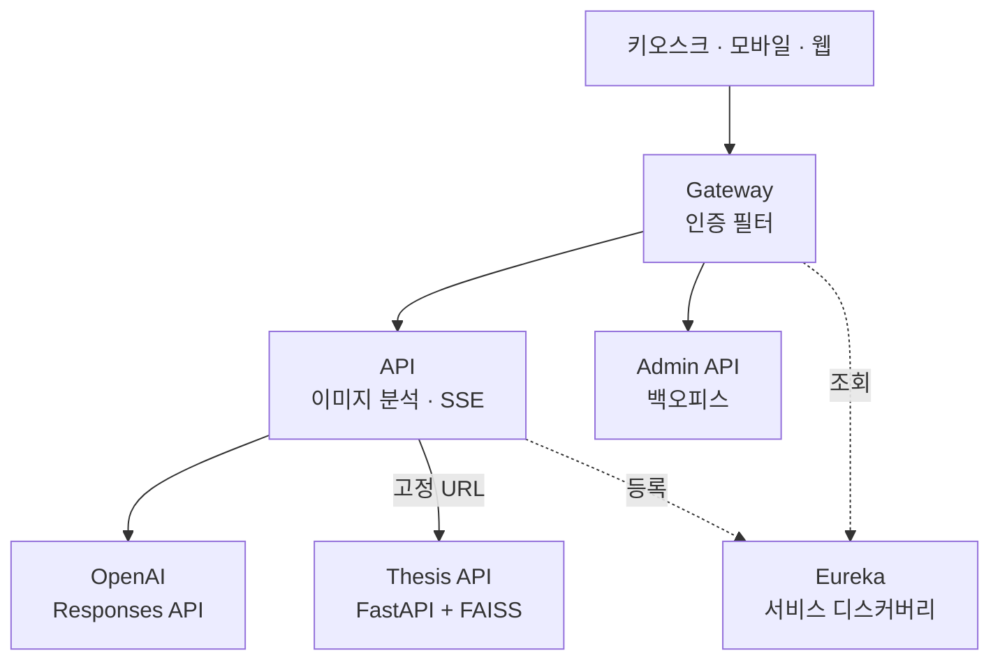

# 마인드픽 — AI 그림심리검사 기반 도서추천 서비스

> **2025.07 ~** | **백엔드·게이트웨이·인프라 전 영역 단독 개발** | 서버 9개 저장소 / 단독 커밋 약 350건
> 그림심리검사(HTP·PITR·KFD) 이미지를 AI가 분석해 심리 상태를 해석하고, 결과에 맞는 도서를 추천하는 도서관용 키오스크·모바일 서비스



## 배경 및 문제

기존 그림심리검사는 전문 상담사의 수기 해석에 의존해 **도서관 단독 운영이 불가능**했습니다. 이를 AI로 대체하면서 다음 세 가지를 동시에 해결해야 했습니다.

1. 검사 유형(HTP/PITR/KFD/요소분석/자유화)마다 해석 기준과 근거 문헌이 전혀 다름
2. 이미지 분석 응답 완성까지 **약 26초**가 걸려 키오스크 UX가 성립하지 않음
3. 도서관마다 별도 계약·기기·구독 기간이 존재해 **기관 단위 접근 제어**가 필요

## 담당 업무 (단독 수행)

- **MSA 아키텍처 설계 및 구축** — Eureka 서비스 디스커버리 + Spring Cloud Gateway 기반, 서비스 5종(Gateway / API / Admin API / Thesis API / Eureka) 설계
- **OpenAI Responses API 연동** — WebClient 기반, 검사 유형별 이미지 분석 파이프라인 구현
- **SSE 스트리밍 분석 API** — WebFlux `Flux` 기반 실시간 토큰 스트리밍
- **RAG(검색 증강 생성) 구축** — 검사 유형별 벡터 스토어를 분리 구성해 심리학 논문 근거 기반 해석 제공
- **도서 소장 정보 연동** — 도서관 자료관리 시스템 API 연동으로 추천 도서의 서가 위치·청구기호·대출 가능 여부를 함께 제공(대출 처리 자체는 하지 않음)
- **Python 마이크로서비스 개발** — FastAPI + FAISS 기반 논문 검색/파싱 서비스를 별도 프로세스로 분리, 환경변수 기반 고정 URL로 연동
- **게이트웨이 인증 필터 자체 구현** — 도서관 코드 + 기기 API Key + 구독 만료일 + IP 화이트리스트 검증
- **LLM 비용 관리 체계** — 요청별 토큰 사용량 수집 및 DB 적재
- **관리자 백오피스** — Spring Security + JWT(Refresh Token) 기반 Admin API 및 화면
- **배포·운영** — Docker 컨테이너화, Jenkins 파이프라인(Gradle 빌드 → Docker 이미지 빌드 → SSH 배포 → 헬스체크 폴링) 구축, api1/api2 두 인스턴스를 순차 배포해 무중단 전환, NCP 운영 서버 구축 및 관리
- **GS인증 전 과정 단독 수행** — 기능리스트 작성, 인증 신청 서류, 저작권 확인, 시험 대응, 결함 조치

## 기술적 선택과 근거

> 아래 코드는 실제 구현을 단순화해 재구성한 예시입니다.

### 1. 이미지 분석 응답을 SSE 스트리밍으로 전환 — 체감 대기 26초 → 5초

이미지 분석은 응답 완성까지 약 26초가 걸려, 블로킹 방식에서는 사용자가 **20~30초 동안 빈 화면을 응시**해야 했습니다. WebFlux `Flux`와 `text/event-stream`(SSE) 기반 엔드포인트를 만들어 분석 텍스트가 생성되는 즉시 클라이언트로 흘려보냈습니다.

- 첫 응답(TTFT) **약 5초**, 요소 분석 전체 출력 완료 **약 15초**
- **체감 대기 시간을 약 5분의 1로 단축**

**SSE는 일반 HTTP 위에서 동작해 게이트웨이·프록시 설정을 그대로 재사용**할 수 있었습니다. 다만 관리자 화면 등 전체 결과가 한 번에 필요한 호출도 있어, **동일 분석 로직을 스트리밍용과 블로킹용 두 엔드포인트로 함께 제공**했습니다.

### 2. SSE 규격상 공백 유실 문제 해결

스트리밍 적용 직후, 클라이언트에 도착한 문장의 **단어가 모두 붙어서 출력되는 문제**가 있었습니다. 원인은 SSE 규격상 `data:` 필드 값의 선행 공백 한 칸이 구분자로 처리되어 제거된다는 점이었고, LLM이 `" 나무는"`처럼 공백을 포함해 보내는 토큰 단위와 충돌한 것이었습니다. **전송 구간에서 공백을 치환해 보내고 클라이언트에서 복원하는 방식으로 해결**했습니다.

```java
// 서버: SSE로 보내기 전, 선행 공백을 일반 space 대신 non-breaking space로 치환
private String encodeForSse(String token) {
    return token.startsWith(" ")
            ? "\u00A0" + token.substring(1)
            : token;
}

@GetMapping(value = "/analyze/stream", produces = MediaType.TEXT_EVENT_STREAM_VALUE)
public Flux<ServerSentEvent<String>> streamAnalysis(@RequestParam Long sessionId) {
    return openAiClient.streamTokens(sessionId)
            .map(this::encodeForSse)
            .map(token -> ServerSentEvent.builder(token).build());
}
```

```javascript
// 클라이언트: 수신 시 non-breaking space를 일반 공백으로 복원
eventSource.onmessage = (event) => {
    appendToOutput(event.data.replace(/\u00A0/g, " "));
};
```

### 3. Java와 Python을 나눈 폴리글랏 MSA

FAISS 벡터 검색과 PDF 표 추출(pdfplumber·camelot)은 Python 생태계가 훨씬 성숙해 있었습니다. Java에서 무리하게 대체하는 대신 **논문 검색·파싱만 FastAPI 독립 서비스로 분리**하고, 환경변수로 지정한 고정 URL로 Spring 측 WebClient가 호출하도록 했습니다. 그 결과 **AI 연산 부하가 메인 API와 격리**되고, 무거운 PDF 배치가 사용자 요청에 영향을 주지 않게 되었습니다.

### 4. 검사 유형별 인덱스 분리 구축 + 검색 시 타입 필터링

HTP·PITR·KFD는 해석 이론과 참조 논문이 서로 다릅니다. 하나의 벡터 스토어에 모든 문헌을 넣으면 **HTP 해석에 KFD 논문이 근거로 딸려 들어오는 오염**이 발생했습니다. 인덱스 **구축은 검사 유형별로 별도 파일로 분리**하고, **검색 시에는 유형별 인덱스를 통합해 유사도 상위 후보를 뽑은 뒤 메타데이터의 유형이 요청 유형과 일치하는 결과만 남기는 방식**으로 교차 오염을 차단해 **검색 정확도와 해석 신뢰도를 확보**했습니다.

### 5. 인증을 각 서비스가 아닌 게이트웨이로 끌어올림

도서관/기기/IP 검증을 서비스마다 중복 구현하면 정책 변경 시 전 서비스를 함께 배포해야 합니다. `AbstractGatewayFilterFactory`를 상속한 **커스텀 인증 필터를 게이트웨이에 두어 인증 정책을 한 곳으로 모았고**, 하위 서비스는 인증을 신경 쓰지 않도록 했습니다. 게이트웨이는 리액티브 스택이라 JPA 블로킹 조회가 이벤트 루프를 막는 문제가 있었는데, **`Mono.fromCallable` + `Schedulers.boundedElastic()`으로 블로킹 구간을 별도 스케줄러에 격리**하고, 게이트웨이에 **Java 21 Virtual Threads**(`spring.threads.virtual.enabled`)를 함께 활성화해 블로킹 스레드 풀의 처리량을 높였습니다. 전면 리액티브 재작성 없이 인증 처리량을 확보한 절충이었습니다. 기기 요청은 API Key와 함께 **구독 만료일·기기 상태까지 검증**해, 계약이 끝난 기기가 자동 차단되도록 설계했습니다.

```java
@Component
public class DeviceAuthGatewayFilterFactory
        extends AbstractGatewayFilterFactory<DeviceAuthGatewayFilterFactory.Config> {

    private final DeviceRepository deviceRepository; // JPA - 블로킹 I/O

    @Override
    public GatewayFilter apply(Config config) {
        return (exchange, chain) -> {
            String apiKey = exchange.getRequest().getHeaders().getFirst("X-Device-Key");

            return Mono.fromCallable(() -> deviceRepository.findByApiKey(apiKey))
                    .subscribeOn(Schedulers.boundedElastic()) // 블로킹 조회를 이벤트 루프 밖으로 격리
                    .flatMap(device -> {
                        if (device.isSubscriptionExpired() || !device.isIpWhitelisted(exchange)) {
                            exchange.getResponse().setStatusCode(HttpStatus.FORBIDDEN);
                            return exchange.getResponse().setComplete();
                        }
                        return chain.filter(exchange);
                    })
                    .switchIfEmpty(rejectUnknownDevice(exchange));
        };
    }

    public static class Config {}
}
```

### 6. LLM 토큰 사용량을 요청 단위로 추적

LLM은 호출량이 곧 비용이라, 기관별 사용량을 모르면 과금 근거도 원가 예측도 불가능했습니다. `ThreadLocal` 기반 `TokenUsageContext`로 요청 처리 중 발생한 토큰을 수집하고, 인터셉터에서 **요청 URI·도서관 코드·모델명·prompt/completion/total 토큰을 `api_call_log` 테이블에 적재**했습니다. 비즈니스 로직에 로깅을 섞지 않으면서 전 API에 일괄 적용할 수 있었고, **기관별 비용 집계의 기반**이 되었습니다.

```java
public class TokenUsageContext {
    private static final ThreadLocal<TokenUsage> HOLDER = new ThreadLocal<>();

    public static void record(String model, int promptTokens, int completionTokens) {
        HOLDER.set(new TokenUsage(model, promptTokens, completionTokens));
    }

    public static TokenUsage get() {
        return HOLDER.get();
    }

    public static void clear() {
        HOLDER.remove(); // 스레드 재사용(풀링) 대비 필수
    }
}

@Component
public class TokenUsageLoggingInterceptor implements HandlerInterceptor {

    private final ApiCallLogRepository apiCallLogRepository;

    @Override
    public void afterCompletion(HttpServletRequest request, HttpServletResponse response,
                                 Object handler, Exception ex) {
        TokenUsage usage = TokenUsageContext.get();
        if (usage != null) {
            apiCallLogRepository.save(ApiCallLog.of(
                    request.getRequestURI(),
                    LibraryContext.getLibraryCode(),
                    usage.model(), usage.promptTokens(), usage.completionTokens()
            ));
        }
        TokenUsageContext.clear();
    }
}
```

### 7. 프롬프트를 코드 밖으로 분리

검사 유형 5종의 프롬프트는 상담 전문가 피드백에 따라 자주 바뀌는 자산입니다. 코드에 하드코딩하면 문구 한 줄 수정에도 재빌드·재배포가 필요합니다. **프롬프트를 리소스 파일로 분리하고 `@PostConstruct` 시점에 유형별 Map으로 로딩**해, 프롬프트 변경을 코드 변경과 분리했습니다.

### 8. Graceful Shutdown 적용

배포 중 진행 중인 분석 요청이 끊기면 사용자가 결과를 못 받고 재시도해야 합니다. mindpick-api·게이트웨이 양쪽에 **Graceful Shutdown(최대 30초)** 을 적용해, 배포로 인한 종료 요청이 들어와도 처리 중인 요청이 끝날 때까지 대기한 뒤 종료하도록 했습니다.

## 결과

- **GS(Good Software) 품질인증 획득 (2026.06)** — 요구사항 정의부터 시험 대응·결함 조치까지 **전 과정을 단독 수행**. 공인시험기관의 기능성·신뢰성 검증 통과
- **조달청 등록 진행 중** — 공공 조달 판매 가능 단계 진입
- **체감 대기 시간 26초 → 5초** (약 5분의 1)
- 서버 5종 + 클라이언트(웹 / Electron 데스크톱 / Android) 로 구성된 **제품 전체를 백엔드 단독으로 지탱**
- 도서관 관련 대외 행사에서 시연 진행 (2026년, 정식 판매 개시 전)
