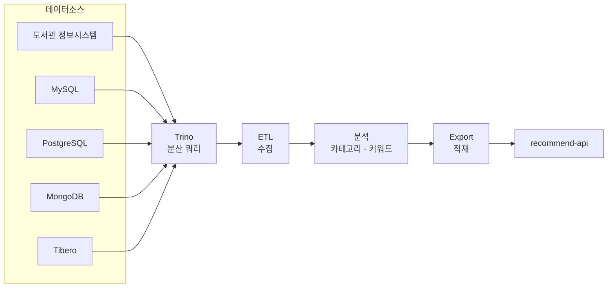

# 도서 추천 시스템 — 대출 이력 기반 추천 데이터 파이프라인

> **2024.01 ~** | **공동 개발** | 본인 커밋 약 100건 (recommend-api 주도, recommend-etl 공동)
> **29개 기관**에 적용 · **월 60만 ~ 180만 건**의 대출 이력을 집계해 추천 도서를 산출 (100만 건 기준 약 80분 소요)



## 담당 업무

- **recommend-api (주도)** — 산출된 추천 결과를 서비스에 제공하는 REST API 개발 및 운영
- **recommend-etl (공동)** — Spring Batch 기반 `ETL → 분석 → Export` 3단 파이프라인. 아래 항목을 본인이 담당했습니다.

### ① 카테고리·키워드 ETL 파이프라인 신규 구축 (2025.07, 단독)

기존 파이프라인은 대출 횟수 기반 통계만 다뤄 **"어떤 성격의 책인지"를 추천에 반영할 수 없었습니다.** LLM으로 생성된 도서 설명 데이터에서 **카테고리·태그·감정 키워드를 추출하는 ETL 단계를 신설**하고, 정제(ML) → 적재(Export) 전 구간까지 확장했습니다. 이 과정에서 **MongoDB를 신규 데이터소스로 추가**하고, 설명 텍스트의 불필요한 태그를 제거하는 정제 규칙을 반복 개선했습니다.

### ② Cold Start 옵션 도입 및 적재 오류 해결 (2024.11)

최초 구축(cold start)과 증분 갱신의 처리 방식이 달라, **증분 실행 시 입력 파일이 존재하지 않아 적재가 실패하는 오류**가 있었습니다. Cold start 여부를 실행 옵션으로 분리하고 **빈 CSV를 생성하는 Step을 추가해 파이프라인이 중단 없이 완주**하도록 했습니다. 이후 파일 복사 자체를 Jenkins Job 조건으로 옮겨 애플리케이션에서 불필요한 로직을 제거했습니다.

> 아래 코드는 실제 구현을 단순화해 재구성한 예시입니다.

```java
@Bean
public Step ensureInputFileStep(JobRepository jobRepository, PlatformTransactionManager tm) {
    return new StepBuilder("ensureInputFileStep", jobRepository)
            .tasklet((contribution, chunkContext) -> {
                JobParameters params = chunkContext.getStepContext()
                        .getStepExecution().getJobParameters();
                boolean isColdStart = "true".equals(params.getString("coldStart", "false"));
                Path inputFile = resolveInputPath(params);

                if (!isColdStart && !Files.exists(inputFile)) {
                    // 증분 실행인데 입력 파일이 없으면 빈 CSV를 만들어 이후 Step이 중단 없이 진행되도록 함
                    Files.createFile(inputFile);
                }
                return RepeatStatus.FINISHED;
            }, tm)
            .build();
}
```

### ③ 레거시 도서관 시스템(v1) 전처리 프로세스 구현 (2024.04~05)

통계 기반(v2)과 별개로, **기존 카테고리 기반 추천을 사용하는 도서관을 위한 v1 전처리 프로세스**를 담당해 구현했습니다. 두 방식이 **Job/Step 구성 단위로 병존**하도록 설계되어, 도서관 환경에 따라 선택 적용이 가능합니다.

### ④ 이기종 DB 대응

도서관마다 상이한 DBMS 환경에 맞춰 PostgreSQL, **Tibero(국산 DBMS)** 프로파일을 추가하고, v1 실행 시 불필요한 데이터소스가 초기화되지 않도록 조건부 설정으로 분리했습니다.

## 기술적 특징

- **이기종 데이터소스 통합** — 도서관 정보 시스템(LAS), MySQL, PostgreSQL, MongoDB, Tibero, **Trino**를 MyBatis 다중 데이터소스로 구성. 대용량 대출 이력 집계는 분산 쿼리 엔진 **Trino에 위임**하고, 애플리케이션은 오케스트레이션만 담당하도록 역할을 분리했습니다.
- **Job/Step 단위 파이프라인 설계** — 수집·분석·적재를 독립 Job으로 분리하고 실행 인자(`--job.name`, `request=yyyyMM`)로 제어. **특정 단계만 재실행 가능**해 장애 복구 시간을 줄였습니다.
