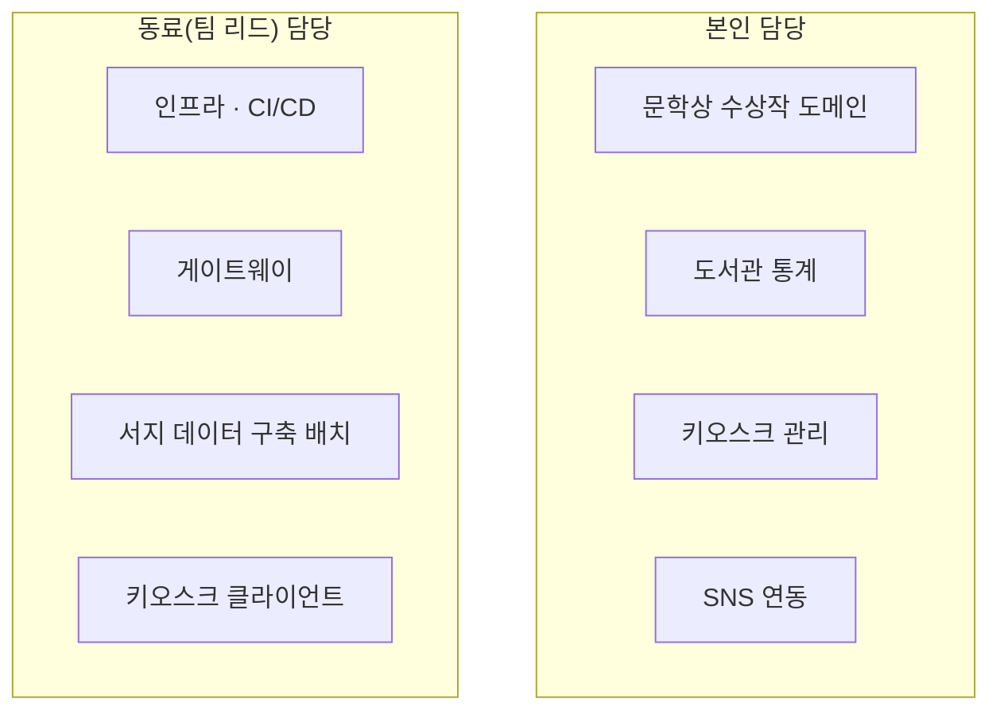

# 북메이트 — 도서관 무인 추천·정보 키오스크 플랫폼

> **2024.01 ~ 재직 중** | **공동 개발 (백엔드 2인)** | 8개 저장소 / 본인 커밋 약 395건 (전체의 약 32%)
> **도입 30개 도서관 · 키오스크 65대 · 일평균 약 2,700건의 키오스크 이용·추천 조회 처리**

## 담당 범위 (본인)

서버에서는 **문학상 수상작 도메인, 도서관 통계, 키오스크 관리, SNS 연동** 영역을 담당했습니다. 인프라·CI/CD·게이트웨이 및 서지 데이터 구축 배치는 동료(팀 리드)가 주도했으며, 본인은 기능 단위로 참여했습니다.

## 주요 작업

- **문학상 수상작 도메인 개발** — 최근 3개년 문학상 수상작을 수집·제공하는 기능을 API·서비스·문서 계층까지 담당하고, 해당 기능의 **테스트 코드를 함께 작성**
- **도서관 이용 통계 수집** — 인터셉터 기반으로 도서관별 일일 이용 통계를 수집하는 구조를 구현. 비즈니스 로직에 집계 코드를 섞지 않고 횡단 관심사로 분리
- **키오스크 관리 기능** — 키오스크 등록·조회 API 및 도서관별 장비 관리. 도서관 코드·키오스크 키 기반으로 장비별 설정을 분리하고, 설정 누락 시 경고하도록 처리해 **65대 규모 배포에서 설정 오류를 예방**
- **SNS 연동 기능 개발** — 도서 SNS 업로드 컨트롤러·서비스 개발 및 **테스트 코드 작성**
- **다국어 메시지 체계 관리** — 메시지 프로퍼티 기반 응답 메시지 일원화
- **운영 이슈 상시 대응** — 외부 API 스펙 변경, SSL 인증서 문제, 배포 환경 이슈 등

## 현장 설치 자동화

이 프로젝트에서 처음 설계한 설치 자동화 체계를 이후 3개 제품에 추가로 적용했습니다. 자세한 내용은 [현장 설치·배포 자동화](05-install-automation.md) 문서를 참고해주세요.
