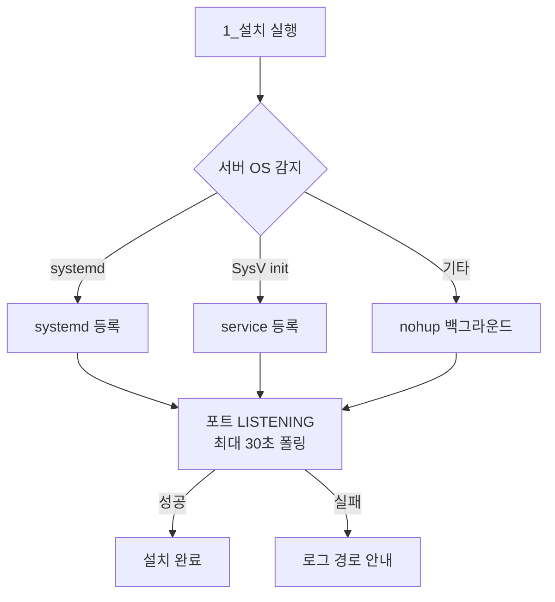

# 현장 설치·배포 자동화 (4개 제품 적용 / 단독 설계·구현)

> 2026 ~ | 북메이트, 도서 추천 시스템, AI 미들웨어, 마인드픽 4개 제품에 적용



30개 기관·65대 규모로 확산되면서 설치 과정 자체가 병목이 되었습니다. 설치할 때마다 **JDK 설치 → 기관별 설정 파일 작성 → 서비스 등록 → 기동 확인**을 수작업으로 진행해 **기관당 약 1시간**이 걸렸고, 현장 인력이 개발자가 아니어서 설정 누락·권한 오류가 반복됐습니다.

## 설계 원칙

- **비개발자를 사용자로 상정** — `1_설치 → 2_재시작 → 3_제거` 번호 순서 체계로 인터페이스를 통일해, 순서대로 실행만 하면 되도록 구성
- **OS 편차 흡수** — 도서관마다 서버 OS가 달라 Linux(systemd)와 Windows(WinSW/NSSM) 양쪽에 동일한 스크립트 인터페이스 제공
- **실행 방식 자동 판별** — 서버 OS 버전이 제각각이라 systemd / SysV init / nohup 백그라운드 세 방식을 자동 감지해 가능한 것으로 기동. 구형 서버까지 동일 스크립트로 커버
- **설치 검증 루프** — 서비스 등록 후 포트의 LISTENING 여부를 최대 30초간 폴링해, "실행 명령을 보냈다"가 아니라 **"실제로 기동됐다"를 확인한 뒤 성공으로 처리**. 실패 시 확인할 로그 경로를 함께 안내
- **멱등성·폐쇄망 대응** — 설정 파일이 이미 존재하면 초기화를 건너뛰어 재실행해도 기존 설정이 유지되도록 하고, 인터넷이 제한된 내부망을 고려해 JDK를 동봉하고 압축 해제·버전 인식까지 자동 처리
- **권한 설계** — 관리자 권한으로 설치하되 서비스는 전용 계정으로 구동하도록 강제. FTP 전송 과정에서 실행 권한이 유실되는 현장 이슈를 반영해 권한 재부여 로직 포함
- **무중단 갱신·책임 분리** — `update-jar` 스크립트를 별도로 두어 재설치 없이 애플리케이션만 교체 가능하도록 하고, 기관별 설정을 대화형으로 입력받는 Initializer를 별도 구성해 스크립트가 설정 로직을 떠안지 않도록 분리

### 예시 코드 — 설치 검증 루프 & 실행 방식 자동 판별

> 아래 코드는 실제 구현을 단순화해 재구성한 예시입니다.

```bash
# 서비스 등록 후, 실제로 포트가 LISTENING 상태인지 최대 30초간 폴링
wait_for_service_ready() {
    local port=$1
    local max_wait=30
    local waited=0

    while [ $waited -lt $max_wait ]; do
        if netstat -an | grep -q "LISTENING.*:${port} "; then
            echo "[OK] 포트 ${port}에서 서비스 기동을 확인했습니다."
            return 0
        fi
        sleep 1
        waited=$((waited + 1))
    done

    echo "[FAIL] ${max_wait}초 내에 기동을 확인하지 못했습니다. 로그: ${LOG_PATH}"
    return 1
}

# 서버마다 지원하는 기동 방식이 달라 가능한 것을 순서대로 시도
start_service() {
    if command -v systemctl >/dev/null 2>&1 && systemctl list-unit-files | grep -q "$SERVICE_NAME"; then
        systemctl start "$SERVICE_NAME"
    elif command -v service >/dev/null 2>&1; then
        service "$SERVICE_NAME" start
    else
        nohup java -jar "$APP_JAR" > "$LOG_PATH" 2>&1 &
        echo $! > "$PID_FILE"
    fi
}
```

## AI 미들웨어(북큐레이션)에서의 확장

핵심 개발자가 아니었음에도 설치 관리를 맡아, 기존에 산재해 있던 설치 자료를 정비하고 **Linux 설치 스크립트 8종을 단독으로 작성**했습니다.

- `install / start / stop / restart / status / remove / update-jar` + 공통 함수 스크립트로 명령 단위 분리
- 스크립트가 심볼릭 링크로 실행되어도 실제 경로를 역추적해 기준 경로를 잡도록 처리
- Windows(NSSM) 설치 자료도 함께 정비해 현장 인력이 이해할 수 있도록 개선

## 결과

설치 소요 시간이 **기관당 약 1시간에서 5분으로(약 12배) 단축**되었고, 개발자 동행 없이 현장 인력만으로 설치·재시작·제거가 가능해졌습니다. 추천 시스템에도 동일 방식을 적용해 약 1시간 → 5분(배치 수행 시간 제외)으로 줄였으며, 마인드픽은 이 경험을 반영해 처음부터 설치 자동화를 전제로 설계했습니다.
